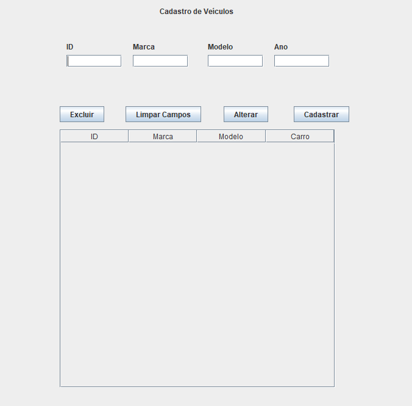

# 🚗 Cadastro de Veículos – Java GUI (JFrame)

Este projeto é uma aplicação simples desenvolvida em **Java** utilizando **Swing (JFrame)** para realizar o CRUD completo de veículos:  
✔ Cadastrar  
✔ Listar  
✔ Alterar  
✔ Excluir  

Tudo é armazenado em memória usando uma lista interna, e os dados são exibidos diretamente em uma `JTable`.

---

## 🛠 Tecnologias Utilizadas

- **Java 8+**
- **Swing (JFrame)**
- **JTable + DefaultTableModel**
- **ArrayList** para armazenamento dos dados

---

## 📸 Interface da Aplicação

> **

---

## ✨ Funcionalidades

### ➕ Cadastrar Veículo
Insere um novo veículo informando:
- ID  
- Marca  
- Modelo  
- Ano  

O item aparece automaticamente na tabela.

---

### ✏️ Alterar Veículo
Selecionando um item na tabela, é possível:
- Editar os campos  
- Atualizar os dados  

---

### ❌ Excluir Veículo
Remove o veículo selecionado da lista e da tabela.

---

### 🧹 Limpar Campos
Limpa todos os inputs e reseta a seleção da tabela.

---

## ▶️ Como Executar

1. Abra o projeto no **NetBeans**, **IntelliJ** ou **VS Code com extensão Java**.
2. Certifique-se de que o JDK está instalado.
3. Compile e execute a classe:

AppVeiculosGUI.java


A interface irá abrir automaticamente.

---

## 📘 Classe Veiculo

```java
public class Veiculo {
    private int id;
    private String marca;
    private String modelo;
    private int ano;

    // Construtores, getters e setters...
}
```
## 📅 Melhorias Futuras (Ideias)

- Persistência usando arquivo .txt ou .json
- Integração com banco (MySQL ou PostgreSQL)
- Sistema de login
- Validações mais robustas
- Estilo visual com LookAndFeel customizado
